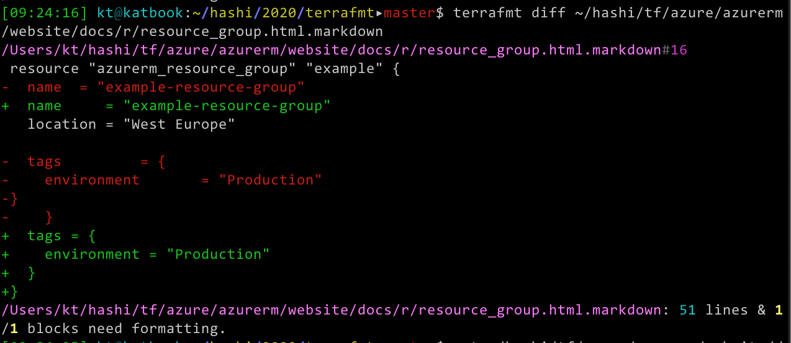
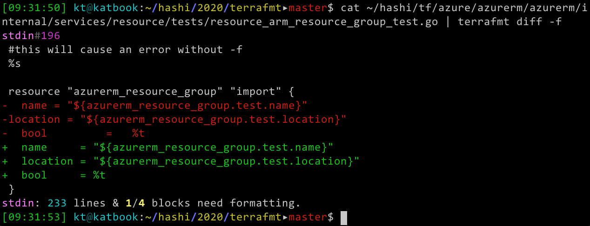
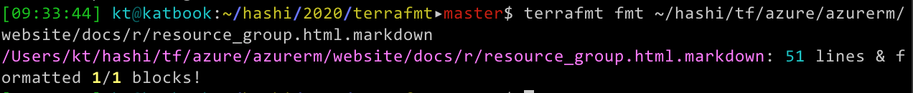
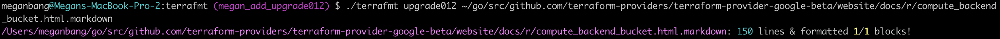

# terrafmt

[](https://travis-ci.com/katbyte/terrafmt)
[](https://golangci.com)
[](https://goreportcard.com/report/github.com/katbyte/terrafmt)

A tool for extracting or formatting [Terraform](https://www.terraform.io/docs/) configuration embedded in [provider](https://www.terraform.io/docs/providers/index.html) code 

## Install

### Local Install

Use Go to install directly into your `$GOBIN` directory (e.g. `$GOPATH/bin`):

```console
go get github.com/katbyte/terrafmt
```

## Usage

Information about usage and options can be found by using the `help` command:

```console
terrafmt help
```

This tool can extract terraform blocks, run `terraform fmt` on the blocks and display the difference or update them in place.

The tool currently supports blocks with the following start and end lines:

|start               |end |
|--------------------|----|
|```hcl              |``` |
|```tf               |`,  |
|```terraform        |`,  |
|return fmt.Sprintf(`|`,  |
|return fmt.Sprintf(`|`)  |
|return `            |`   |

### Extract Terraform Blocks

Use the `blocks` command to extract blocks from a file:


To output only the block content, separated by the null character, use the flags `--zero-terminated` or `z`.

To output the blocks using a JSON structure, use the flags `--json` or `-j`. The format is

```json
{
    "block_count": 1,
    "blocks": [
        {
            "start_line": 4,
            "end_line": 9,
            "text": "..."
        }
    ]
}
```

Go [format verbs](https://golang.org/pkg/fmt/) can be escaped in the output blocks by using the flags `--fmtcompat` or `-f`.

To output the blocks using a JSON structure, use the flags `--json` or `-j`. The format is

```json
{
    "block_count": 1,
    "blocks": [
        {
            "start_line": 4,
            "end_line": 9,
            "text": "..."
        }
    ]
}
```

### Show What Format Would Do

Use the `diff` command to see what would be formatted (files can also be piped in on stdin) :

 

For code files with printf verb formatting use the `-f` switch :



### Format File

Use the `fmt` command to format the blocks:



### Format Multiple

One can use find and egrep to format multiple files:
```shell
find . | egrep "html.markdown" | sort | while read f; do terrafmt fmt -f $f; done
./website/docs/d/api_management.html.markdown: 136 lines & formatted 0/1 blocks!
./website/docs/d/api_management_api.html.markdown: 79 lines & formatted 0/1 blocks!
./website/docs/d/api_management_group.html.markdown: 46 lines & formatted 0/1 blocks!
./website/docs/d/api_management_product.html.markdown: 52 lines & formatted 0/1 blocks!
./website/docs/d/api_management_user.html.markdown: 48 lines & formatted 0/1 blocks!
./website/docs/d/app_service.html.markdown: 139 lines & formatted 0/1 blocks!
./website/docs/d/app_service_certificate.html.markdown: 54 lines & formatted 0/1 blocks!
./website/docs/d/app_service_certificate_order.html.markdown: 79 lines & formatted 0/1 blocks!
```

### Upgrade Terraform in a File to 0.12

Use the `upgrade012` command to upgrade the blocks to 0.12:



### Exit codes

To help usage of `terrafmt` in workflows, some commands will return actionable exit codes.

If a Terraform parsing error is encountered in a block, the exit code is `2`.

If the command `diff` with the `--check` flag enabled encounters a formatting difference, it will return `4`. If a file contains both blocks with parsing errors and a formatting difference, it will combine the exit codes to return `6`. These codes can be tested using bitwise checks.

Otherwise, `terrafmt` will return `1` on an error.

## Development and Testing

This project uses [Go Modules](https://github.com/golang/go/wiki/Modules) for dependency management.

### Updating Dependencies

```console
$ go get URL
$ go mod tidy
$ go mod vendor
```

### Unit Testing

```console
$ go test ./...
```

### Local Install

```console
$ go install .
```
