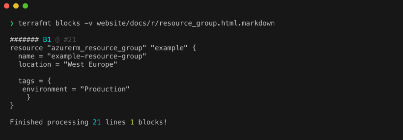
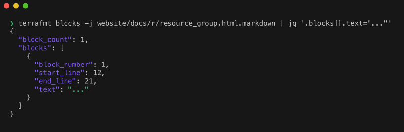
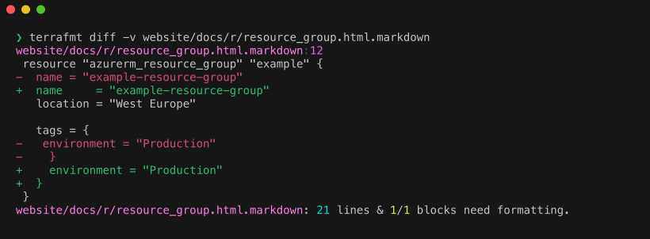
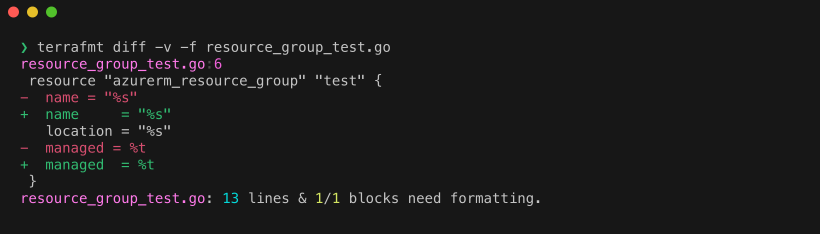
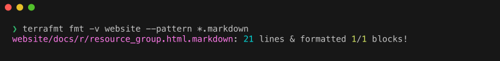

# terrafmt

[](https://github.com/katbyte/terrafmt/releases/latest)


[](https://github.com/katbyte/terrafmt/blob/main/go.mod)
[](https://github.com/katbyte/terrafmt/blob/main/LICENSE)

A tool for extracting and formatting [Terraform](https://www.terraform.io/docs/) configuration embedded in other files, primarily intended to help with [provider](https://www.terraform.io/docs/providers/index.html) development.

## Install

### Homebrew

```console
brew install katbyte/tap/terrafmt
```

### Pre-built binaries

Binaries for linux, macOS, windows, freebsd, openbsd, and solaris are attached to each [release](https://github.com/katbyte/terrafmt/releases/latest).

### Go

```console
go install github.com/katbyte/terrafmt@latest
```

## Usage

Information about usage and options can be found by using the `help` command:

```console
terrafmt help
```

terrafmt finds terraform blocks embedded in files, runs the equivalent of `terraform fmt` on them, and can display the difference or update them in place. It understands:

- **Markdown** (`.md`, `.markdown`, and other non-go files): fenced code blocks opened with ` ```hcl `, ` ```tf `, or ` ```terraform `
- **reStructuredText** (`.rst`): `.. code:: terraform` directives (block indentation is preserved)
- **Go** (`.go`): multiline string literals that look like terraform configuration, e.g. acceptance test configs returned by `fmt.Sprintf`

### Extract Terraform Blocks

Use the `blocks` command to extract blocks from a file:



To output only the block content, separated by the null character, use `--zero-terminated`/`-z`.

To output the blocks as JSON, use `--json`/`-j`:



Go [format verbs](https://golang.org/pkg/fmt/) (`%s`, `%d`, `%[1]q`, ...) can be escaped in the output blocks with `--fmtcompat`/`-f`.

### Show What Format Would Do

Use the `diff` command to see what would be formatted (files can also be piped in on stdin):



For go files containing format verbs use the `-f` switch:



### Format Files

Use the `fmt` command to format blocks in place. It accepts a single file, stdin, or a directory to walk — combine with `--pattern`/`-p` to filter by file name:



```console
terrafmt fmt ./website --pattern '*.markdown'
terrafmt fmt ./internal --pattern '*_test.go' -f
```

### Exit codes

To help usage of `terrafmt` in workflows, some commands return actionable exit codes.

If a terraform parsing error is encountered in a block, the exit code is `2`.

If the `diff` command with the `--check` flag enabled encounters a formatting difference, it will return `4`. If a file contains both blocks with parsing errors and a formatting difference, the codes combine to `6`. These can be tested using bitwise checks.

Otherwise, `terrafmt` returns `1` on an error.

### Environment variables & config file

Most flags can also be set with an environment variable, or persisted in a `.terrafmt` config file in the current directory or your home directory. Flags take precedence over environment variables, which take precedence over the config file.

| Flag                 | Environment variable        |
|----------------------|-----------------------------|
| `--fmtcompat`/`-f`   | `TERRAFMT_FMTCOMPAT`        |
| `--check`/`-c`       | `TERRAFMT_CHECK`            |
| `--verbose`/`-v`     | `TERRAFMT_VERBOSE`          |
| `--quiet`/`-q`       | `TERRAFMT_QUIET`            |
| `--uncoloured`/`-u`  | `TERRAFMT_UNCOLOURED`       |
| `--pattern`/`-p`     | `TERRAFMT_PATTERN`          |
| `--fix-finish-lines` | `TERRAFMT_FIX_FINISH_LINES` |

The config file uses `key=value` lines with the flag names as keys, for example:

```console
fmtcompat=true
pattern=*.markdown
```

## Development

This project uses [Go Modules](https://github.com/golang/go/wiki/Modules) with a vendored `vendor/` directory.

```console
make help       # list all targets
make build      # build the binary
make test       # run the tests (with -race)
make lint       # run golangci-lint
make lint-fix   # run golangci-lint and apply autofixes
make fmt        # gofmt/gofumpt/goimports the source
make depscheck  # verify go.mod/go.sum/vendor are consistent
make check-all  # build + test + lint + depscheck
```

When updating dependencies, re-vendor:

```console
go get <module>
go mod tidy
go mod vendor
```

## Releasing

Releases are cut by pushing a semver tag; CI ([goreleaser](https://goreleaser.com)) builds the binaries, publishes the GitHub release, and updates the [homebrew tap](https://github.com/katbyte/homebrew-tap) formula:

```console
git tag v0.6.0
git push origin v0.6.0
```
